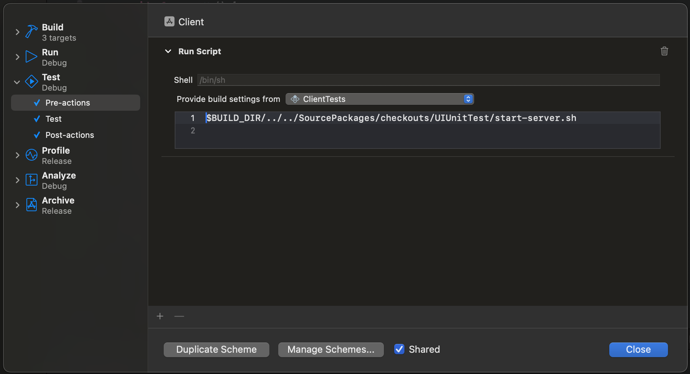

# UIUnitTest

Run XCTest UI commands from your unit test.

## How it works

When you run an UI test, Apple runs two processes: the UI test process and the app process. The UI test process is the one that runs your test code and the app process is the one that runs your full app. Because these two are different process, you lose the ability to modify your app state from your test code. UIUnitTest solves this problem by running your unit test instead of the app, and running the UI test process with a server to receives commands from your unit test code and execute them.

## Installation

1. Install the package:

```swift
.package(url: "git@github.com:BrunoMazzo/UIUnitTest.git", from: "0.4.0")
```

2. Add it to your Unit test target

3. Add a server start on your test scheme pre action:

   3.1 Select your test target on `Provide build settings from`
   
   3.2 Add the command: 
    ```shell
    
    $BUILD_DIR/../../SourcePackages/checkouts/UIUnitTest/start-server.sh
    ```

    

    3.3 Add post action to stop the server:
    ```shell
    
    $BUILD_DIR/../../SourcePackages/checkouts/UIUnitTest/stop-server.sh
    ```

4. Start coding


## Usage

```swift

import UIUnitTest

...

@MainActor
func testExample() {
    let app = App()

    let viewYouWantToTest = YourSwiftUIView(...) // or UIViewController

    showView(viewYouWantToTest)
    
    app.button(identifier: "some button identifier").tap()

    ...
}
```
