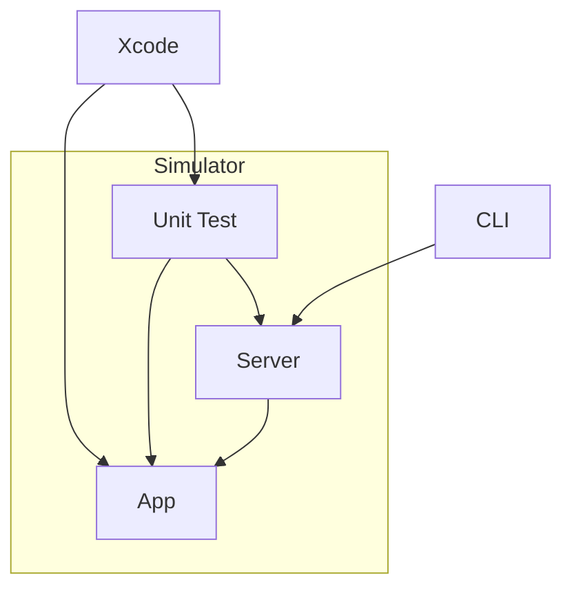

# Quick implementation

My idea will be initially something similar with the diagram:

The sequence will be:
- The CLI start the server inside the simulator. 
- The user run the unit test
  - The unit test will start the app inside the simulator
- The unit test then is capable of calling the server
- And the server will be able to execute UIXCTests commands

I started working in a basic implementation. 
- I need to build an package that will be used to call the server from inside the unit test. 
  - The request and response will be shared between the server and the client library, I started with a shared lib 
- A UI test project that will be used to run the server and run the UI XCTests commands. 
- And a command line application to install the server into the simulator e run "the test" for the server to go up.

The shared lib will not be a problem, I have experience with that. But the command line application will be a challenge, so I'm starting with it. I don't plan to initially make it a full implementation, for now I want something that work, but it can have some hard edges.

## The command line application

I created a new Swift Package to be the CLI. I'm still not using Swift Argument Parser, but I plan to add it later. For now, the CLI will get a ZIP file that will be the server project, unzip it into the tmp folder of the user, then execute an `xcodebuild` command to build the server project, and then run the UI Test into the simulator.

I started with a hardcoded simulator, but I plan to add a parameter to select the simulator. 

### Problems

The server doesn't work well if the simulator is not running already. And the server test fails without any reason. I am testing some changes to see if I can make it more stable, I think it improved a bit, but I still need to test more. I think it is possible, I'm using the same approach that the Maestro and other frameworks uses, so in the worst case I can see what they are doing differently.

Ideally, the server project would not need to resolve any package. This will be a little challenging, for now I'm not dealing with it, but I want to improve later. The only thing I did about it, is to move the shared package declaration to inside the Server project, so it will not need to resolve it.

I need a better way to send the bundle id to the server, at the moment it is the first request that the unit test makes, but ideally it would not need to do it. One option is to add to the server command, but I'm still not sure which way is best.

## Next steps

I will start implementing the UI XCTest interface. I need a bigger project to test it. After the UI XCTest interface is implemented, probably start thinking about releasing a version 0.0.1. Then I would need to prepare a readme and organize the project a little bit.